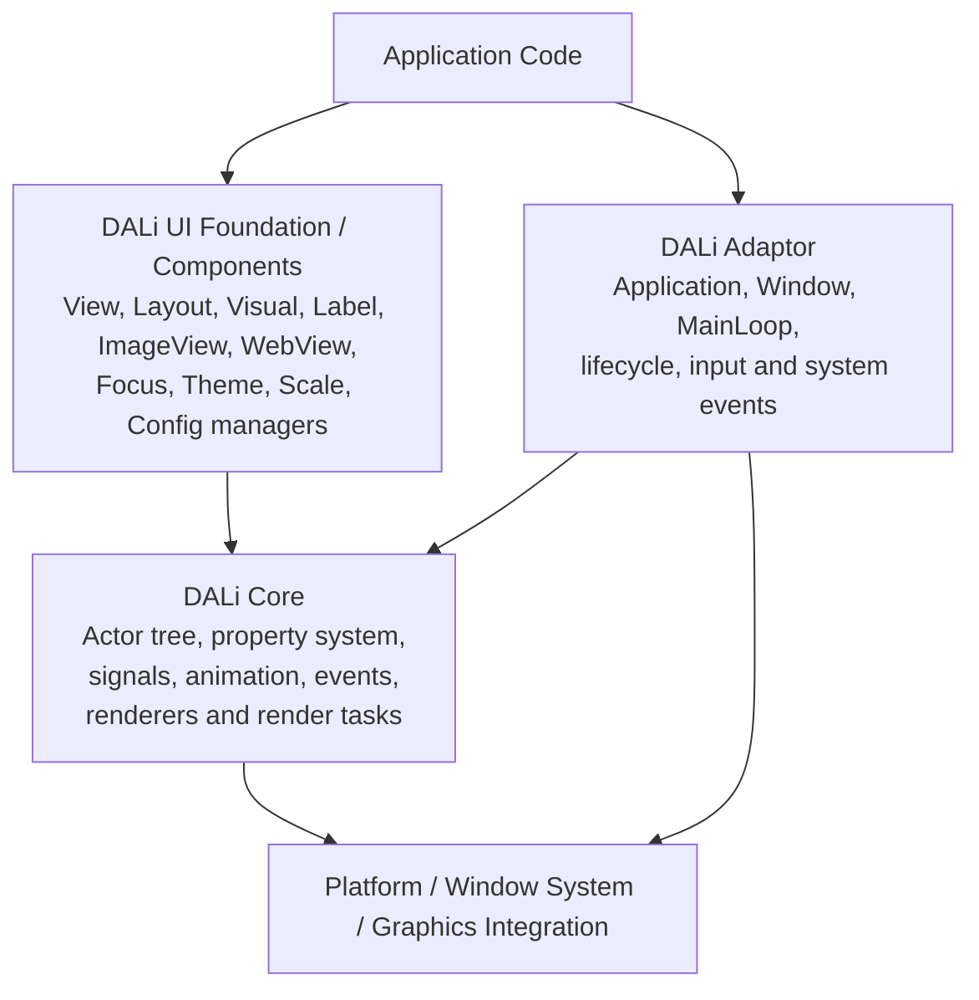
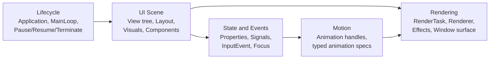
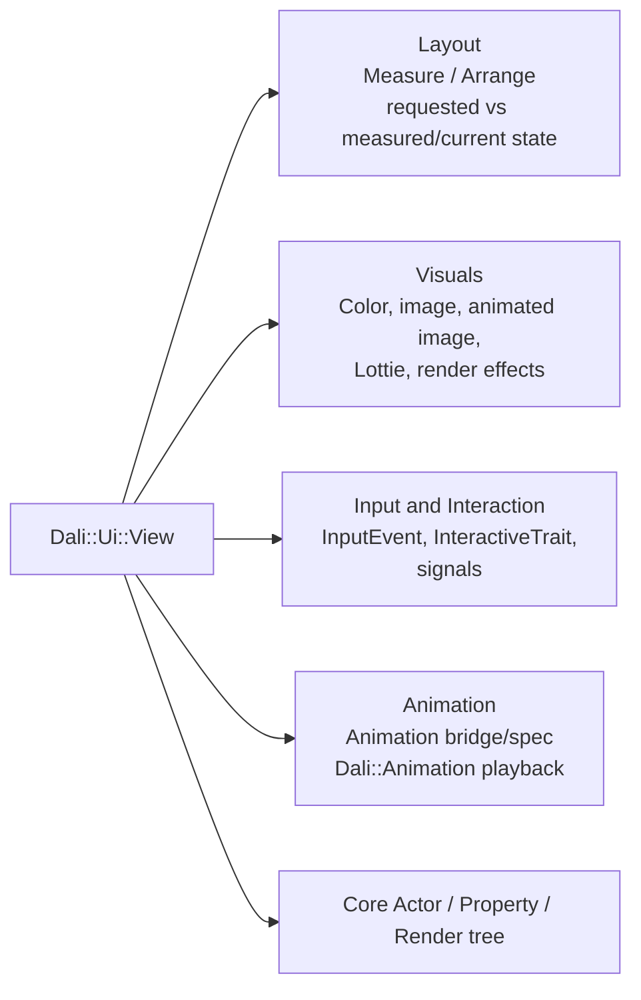
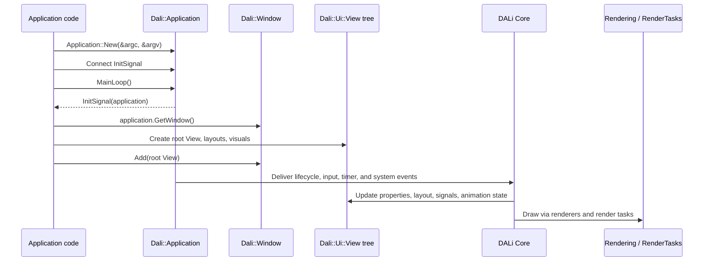
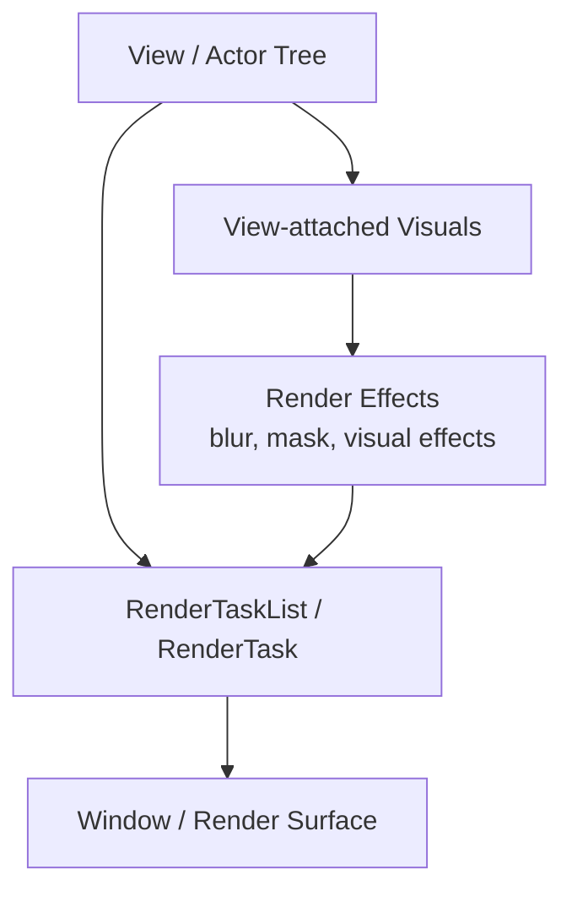
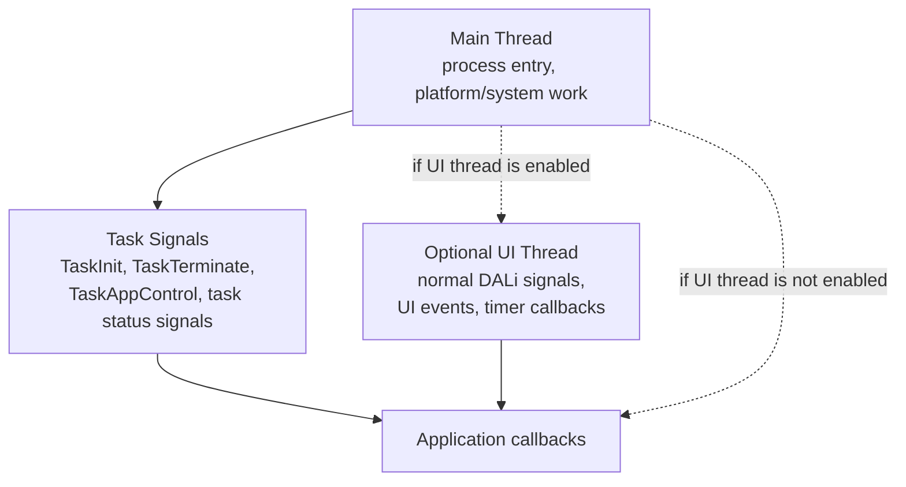
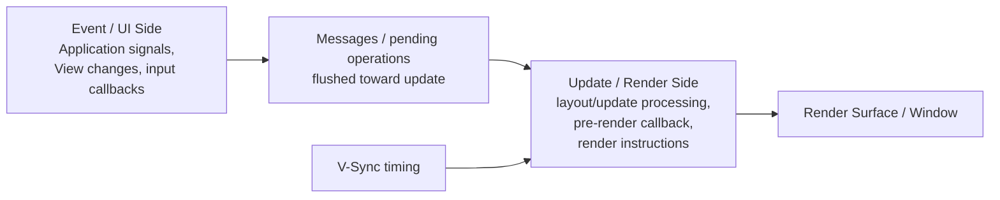
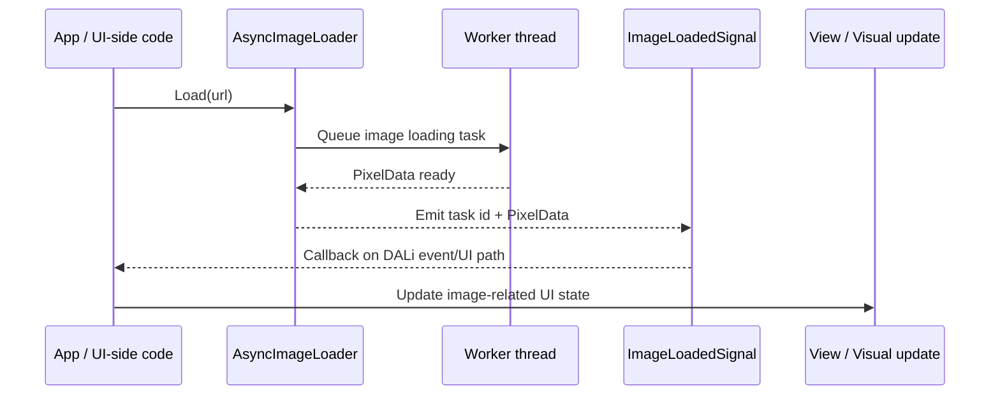

# DALi Overview

DALi, the Digital Adaptive Library, is a C++ UI and application framework built around a retained object tree, signal-driven events, typed UI components, layout objects, visual content, and animation. This overview summarizes DALi from the perspective of application architecture rather than API-by-API usage.

## Table of Contents

- [Introduction](#introduction)
- [Overall Structure](#overall-structure)
- [Core Concepts](#core-concepts)
- [Key Operational Points](#key-operational-points)
- [Runtime and Threading Model](#runtime-and-threading-model)
- [How DALi Differs from Other UI Frameworks](#how-dali-differs-from-other-ui-frameworks)

## Introduction

DALi solves the problem of building interactive, animated, visually rich application interfaces through a structured C++ API. A DALi application is not just a collection of widgets: it is an object tree connected to an application runtime, a window, a layout system, input events, signals, visual content, and rendering primitives.

At the application level, `Dali::Application` is the normal entry point. It initializes the DALi runtime, exposes lifecycle signals, provides the main loop, and gives access to the main `Dali::Window`. Application UI objects should be created after `InitSignal` is emitted, because the window is valid after application initialization.

At the UI level, the app-facing object is `Dali::Ui::View`. DALi applications normally build a tree of views, compose layouts, attach visuals, connect interaction traits and signals, and drive animation through typed APIs.

At the lower level, DALi Core provides the object/property model, actor tree, animation handles, signals, rendering classes, render tasks, input event types, and math types. DALi Adaptor connects this core runtime to the platform application loop and window system. DALi UI Foundation and components provide the higher-level UI model that application developers normally use.

For a manager or architect, the useful mental model is this: DALi separates application intent from rendering execution. Application code declares and mutates a retained UI tree; DALi coordinates layout, event delivery, animation state, resource work, update processing, and rendering.

## Overall Structure

DALi is best understood as a layered system. Application code uses the adaptor to enter the runtime and uses dali-ui to construct the visible interface. dali-ui itself sits on DALi Core concepts such as actors, properties, signals, rendering, and animation.

The same structure can also be read as a responsibility map. This is often the more useful view for planning presentations, system ownership, or migration from another UI framework.

The normal application structure is:

1. Create `Dali::Application` with `Application::New`.
2. Connect setup logic to `InitSignal`.
3. In the init callback, call `GetWindow`.
4. Create a root `Dali::Ui::View` tree.
5. Add the root view to the `Dali::Window`.
6. Enter `MainLoop`.

That gives DALi a clear lifecycle boundary: application objects exist inside a runtime that owns the event loop and a window, while UI content is represented by a view tree.

In short: the adaptor gets the process into the DALi runtime, dali-ui gives the application a view/component vocabulary, and DALi Core provides the retained object, signal, property, animation, and rendering machinery underneath.

## Core Concepts

### Application and Window

`Dali::Application` initializes the runtime and exposes lifecycle/system signals such as `InitSignal`, `PauseSignal`, `ResumeSignal`, `TerminateSignal`, `ResetSignal`, `LanguageChangedSignal`, `RegionChangedSignal`, `LowBatterySignal`, `LowMemorySignal`, and `DeviceOrientationChangedSignal`.

`Dali::Window` is the host for the visible tree. Public APIs include adding and removing actors, setting window background color, retrieving root and overlay layers, accessing render tasks, and receiving key/touch/window signals. In a dali-ui application, the root object added to the window should normally be a `Dali::Ui::View` or a view-derived component.

### View as the App-Facing UI Object

`Dali::Ui::View` is the central app-facing UI concept. It is the base UI object used to build application interfaces. It supports:

- hierarchy through parent/child view composition,
- typed setters and fluent method chaining,
- layout participation through requested, measured, and current size/state,
- visual decoration such as background, borders, corner radius, and visuals,
- interaction through `InteractiveTrait`,
- animation through typed animation bridges/specs and `Dali::Animation`,
- downcasting from generic handles when needed.

This is an important architectural distinction: DALi Core exposes `Actor`, but dali-ui application guidance centers on `View`. In practice, `Actor` remains the core retained-object/render tree foundation, while `View` is the application-level UI abstraction.

### Layout

DALi UI layout is explicit and object-based. `Dali::Ui::Layout` is a `View` specialization, and concrete layouts include `AbsoluteLayout`, `FlexLayout`, and `GridLayout`. Child-specific behavior is carried by layout parameter objects such as `AbsoluteLayoutParams`, `FlexLayoutParams`, and `GridLayoutParams`.

DALi UI separates requested layout inputs from measured/current results. A view can request width, height, margin, and related constraints; the layout pass measures and arranges views; app code can inspect measured and current state separately.

This resembles layout concepts found in other retained UI frameworks, but DALi exposes the measure/arrange distinction directly through `View` APIs and layout parameter handles.

### Visuals

Visuals are reusable visual content objects attached to a `Dali::Ui::View`. They are used for color fills, images, animated images, Lottie content, and effects. Visuals let a view carry visual content without requiring every visual element to be modeled as a separate high-level UI component.

The result is a composition model with two layers:

- the `View` tree controls structure, layout, interaction, and ownership,
- visuals provide rendered content within view-defined slots or ranges.

### Signals and Events

DALi uses `Dali::Signal` for event delivery. Signals have typed callback signatures, can be managed with `ConnectionTracker`, and support return-value behavior for non-void signal types. Application, window, view, interactive traits, image loading, focus management, and many component APIs use signal connections.

Input is represented through typed event objects. `Dali::Ui::InputEvent` can represent touch, key, tap, long press, wheel, or no input cause. Interactive views and traits pass `InputEvent` to application callbacks, which lets application code react to the cause of an interaction without treating every event source as a separate API family.

### Animation

DALi has a first-class animation model. dali-ui apps can animate `View` through typed animation bridges/specs while using `Dali::Animation` for playback control. In other words, animation is not only a widget-level convenience; it is tied to the property/object model and can be managed as a runtime object.

This matters architecturally because application UI state can be expressed as view properties and then animated by the DALi runtime rather than manually updated in application code.

### Managers and Cross-Cutting Services

DALi UI also provides services around the view tree:

- `FocusManager` for focus behavior,
- `UiScaleManager` for scale factors,
- `UiThemeManager` and `UiColorManager` for theme and color binding,
- `UiConfig` and `UiComponentConfig` for configuration,
- image loading APIs for asynchronous image data workflows.

These APIs indicate that DALi UI is not only a set of controls. It also provides application-wide systems for styling, scaling, focus, resources, and configuration.

### Resource Loading and Async Work

DALi includes APIs that deliberately move expensive work away from the main event path. `Dali::Ui::AsyncImageLoader` is the clearest public example: it loads pixel data from a URL asynchronously in a worker thread to avoid blocking the main event thread. Each `Load` call returns a task id, and completion is reported through `ImageLoadedSignal`.

The adaptor devel API also exposes `EventThreadCallback`, which lets a worker thread trigger a callback on the main event thread. This is a useful architectural signal: background work exists, but UI-facing callbacks and object changes need to return to the event/UI side of the framework.

## Key Operational Points

### Runtime Startup Flow

The application startup flow is signal-oriented. The application creates an `Application` handle, connects to `InitSignal`, and enters `MainLoop`. UI creation happens in the init callback.

### Retained Tree and Handle Semantics

DALi APIs use handle objects. A `View` handle refers to an underlying object, and copying the handle keeps another reference to the same object. This is different from immediate-mode UI models where the interface is rebuilt from scratch every frame by user code.

For developers coming from Qt, Android, or Flutter, the closest conceptual mapping is a retained object tree: application code creates objects, connects callbacks, changes properties, and lets the framework process layout, signals, animation, and rendering.

### Layout and Render State Are Not the Same Thing

DALi UI separates layout intent from current visual state. Requested size/position, measured size, current size, transform, color, visual state, and rendered results are not all the same category.

For architectural work, this means an app should use layout APIs for layout participation and use animation/render-state APIs for animated or current visual behavior. Mixing low-level property writes into layout-driven UI should be a deliberate choice, not the default app pattern.

### ParentOrigin and Pivot

Two placement concepts are especially important when reasoning about DALi positioning and transforms:

- `ParentOrigin` chooses the reference point inside the parent coordinate space.
- `Pivot` chooses the reference point inside the child itself.

When a child view is positioned, the child's pivot is aligned relative to the selected parent origin. This is why the same position value can produce a different visual result depending on whether the child uses `Pivot::TOP_LEFT`, `Pivot::CENTER`, or another pivot constant.

For 2D layout, DALi's predefined `ParentOrigin` and `Pivot` constants use `z = 0.5f`. `ParentOrigin::DEFAULT` is `TOP_LEFT`, while `Pivot::DEFAULT` is `CENTER`. Application-level code can use `Dali::Ui::View::SetParentOrigin` and `Dali::Ui::View::SetPivot` when it needs explicit anchoring behavior.

### Input Delivery and Interaction

At the core level, `Actor` has touch and hover signal behavior, and hit testing depends on conditions such as sensitivity, visibility, size, color opacity, camera/render-task context, and whether relevant input signals are connected. At the dali-ui level, application code normally uses `View` interaction APIs such as `InteractiveTrait`, `InteractiveView`, focus management, and typed input events.

This gives DALi both low-level scene/event control and higher-level component interaction. App-level guidance should prefer view-centric input APIs unless the code is explicitly integrating with core actor behavior.

### Rendering and Effects

DALi exposes rendering concepts through core classes and view-level effects. Effect objects include Gaussian blur, background blur, and mask effects. The `Window` API exposes render task access, and the core public API includes rendering-related classes.

The practical architectural point is that DALi does not hide the rendering model completely behind widgets. It provides UI components and visuals for app productivity, while still keeping render tasks, renderers, visuals, effects, textures, shaders, and property-driven animation available through public APIs.

## Runtime and Threading Model

DALi exposes several thread-related concepts in public and integration headers. The safest description is not a single universal thread layout, but a separation between the event/UI side, worker tasks, and the update/render side.

### Event, UI, and Task Signals

`Dali::Application` documents an optional UI thread feature. When this feature is enabled, `Application` creates an additional UI thread for UI events. In that mode, normal application signals such as `Init`, `Terminate`, `Pause`, `Resume`, `Reset`, `AppControl`, language, region, low battery, and low memory are emitted on the UI thread. Task signals such as `TaskInit`, `TaskTerminate`, `TaskAppControl`, `TaskLanguageChanged`, `TaskLowBattery`, and `TaskLowMemory` are emitted on the main thread.

The same header states that callbacks of DALi signals except task signals are emitted on the UI thread when this feature is enabled, with timer callbacks given as an example. When the UI thread feature is not used, normal application signal documentation states that those signals are emitted on the main thread.

The practical rule is that UI object work belongs on the DALi event/UI side. The `Application` documentation explicitly says that if code needs to handle windows or actors in cases such as low-memory handling, it should use the normal signals rather than task signals.

### Update and Render Side

The adaptor integration API shows a separate update/render execution side. `Adaptor::SetPreRenderCallback` documents that the callback is called from the Update/Render thread prior to rendering and warns that it should do as little work as possible. It also states that DALi event-side APIs cannot be called from that callback because doing so may cause instability.

The internal adaptor threading-mode header currently names `COMBINED_UPDATE_RENDER` as a mode with three threads: Event, V-Sync, and a joint Update/Render thread. Other integration APIs expose render-thread-related callbacks and render thread IDs. Therefore the important architectural point is not the exact thread count in every build, but the boundary: event-side API usage and update/render execution are separate concerns.

`UiContext` also documents `FlushUpdateMessages`, described as relayouting the application and ensuring all pending operations are flushed to the update thread. This reinforces the idea that app-side changes are transferred into the update/render side rather than directly executed as rendering work at the call site.

### Worker Tasks and Callback Return

Some DALi subsystems use worker threads for expensive work. `AsyncImageLoader` loads image pixel data in a worker thread, and completion is delivered through `ImageLoadedSignal`. The adaptor devel API's `EventThreadCallback` provides a general mechanism for a worker thread to trigger a callback in the main event thread.

This pattern is important for application design. Long-running I/O or decoding should not block the event/UI path. At the same time, UI updates should be made through framework callbacks and public handles on the event/UI side.

## How DALi Differs from Other UI Frameworks

For someone familiar with Qt, Android, Flutter, or similar frameworks, DALi has several notable traits:

- It is C++ and handle-based, with explicit public handles such as `Application`, `Window`, `View`, `Layout`, `Visual`, `Signal`, and `Animation`.
- The app-facing UI model is view-centric, but the underlying core model still exposes actor/property/render concepts.
- It treats animation as a first-class runtime object rather than only as a per-widget helper.
- It uses typed signals across application lifecycle, window events, component events, interaction, resource loading, and managers.
- It separates layout request/measure/arrange state from current rendered state.
- It supports visual composition through view-attached visuals, not only through child widgets.
- It offers lower-level rendering and effect concepts when needed, while allowing typical app code to remain in the `Dali::Ui::View` layer.
- It makes thread boundaries visible in the API: normal UI work, optional UI-thread signal delivery, worker-thread resource loading, and update/render-side callbacks have different rules.

The main advantage of this structure is flexibility. An application can be written mostly in high-level dali-ui terms, but the framework still exposes enough of the object, property, animation, and rendering model for sophisticated UI behavior.

The corresponding responsibility is discipline: app code should normally stay in the view-centric public API, use typed setters and layout parameters, connect signals with correct signatures, and reserve core actor/render APIs for cases where that lower-level control is actually needed.
