# DALi 개요

DALi(Digital Adaptive Library)는 retained object tree, signal 기반 이벤트, typed UI component, layout object, visual content, animation을 중심으로 구성된 C++ UI 및 애플리케이션 프레임워크입니다. 이 문서는 개별 API 사용법이 아니라, DALi를 애플리케이션 아키텍처 관점에서 이해하기 위한 Overview입니다.

## 목차

- [DALi의 개념](#dali의-개념)
- [전체 구조](#전체-구조)
- [핵심 컨셉](#핵심-컨셉)
- [동작상 주요 특징](#동작상-주요-특징)
- [Runtime과 Threading Model](#runtime과-threading-model)
- [다른 UI 프레임워크와 비교했을 때의 특징](#다른-ui-프레임워크와-비교했을-때의-특징)

## DALi의 개념

DALi는 interactive하고 animated하며 visually rich한 애플리케이션 UI를 구조적인 C++ API로 만들기 위한 프레임워크입니다. DALi 애플리케이션은 단순한 widget 모음이 아니라, application runtime, window, layout system, input event, signal, visual content, rendering primitive와 연결된 object tree입니다.

애플리케이션 레벨에서 일반적인 진입점은 `Dali::Application`입니다. `Dali::Application`은 DALi runtime을 초기화하고, lifecycle signal을 제공하며, main loop를 실행하고, main `Dali::Window`에 접근할 수 있게 합니다. public adaptor 문서에 따르면 window는 initialization 이후 유효하므로, 애플리케이션 UI 객체는 `InitSignal`이 emit된 뒤에 생성해야 합니다.

UI 레벨에서 앱이 주로 다루는 객체는 `Dali::Ui::View`입니다. DALi 애플리케이션은 일반적으로 view tree를 만들고, layout을 조합하고, visual을 attach하고, interaction trait과 signal을 연결하며, typed API를 통해 animation을 구동합니다.

더 낮은 레벨에서 DALi Core는 object/property model, actor tree, animation handle, signal, rendering class, render task, input event type, math type을 제공합니다. DALi Adaptor는 이 core runtime을 platform application loop 및 window system과 연결합니다. DALi UI Foundation과 component 계층은 애플리케이션 개발자가 일반적으로 사용하는 더 높은 수준의 UI model을 제공합니다.

관리자나 아키텍트 관점에서 유용한 mental model은 다음과 같습니다. DALi는 application intent와 rendering execution을 분리합니다. 애플리케이션 코드는 retained UI tree를 선언하고 변경하며, DALi는 layout, event delivery, animation state, resource work, update processing, rendering을 조율합니다.

## 전체 구조

DALi는 계층형 시스템으로 이해하는 것이 가장 자연스럽습니다. 애플리케이션 코드는 adaptor를 통해 runtime에 진입하고, dali-ui를 통해 보이는 UI를 구성합니다. dali-ui 자체는 actor, property, signal, rendering, animation과 같은 DALi Core 개념 위에 놓여 있습니다.

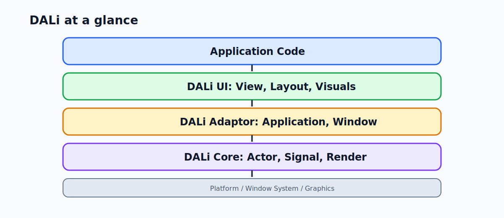

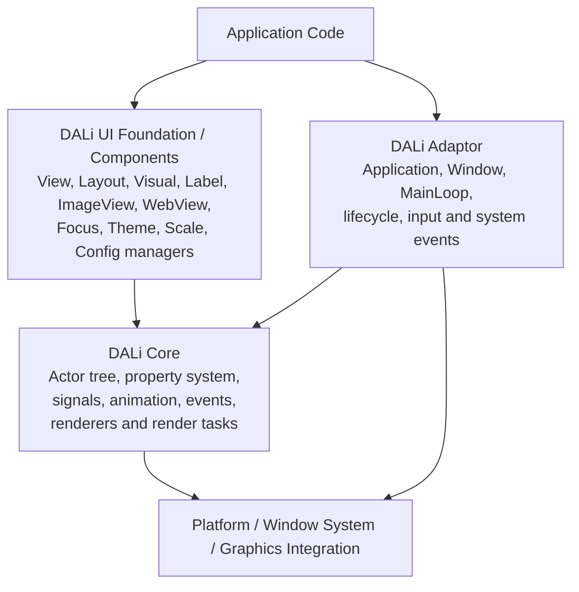

같은 구조를 responsibility map으로 보면 다음과 같습니다. 이 관점은 presentation, system ownership, 다른 UI framework에서의 migration을 설명할 때 더 유용합니다.

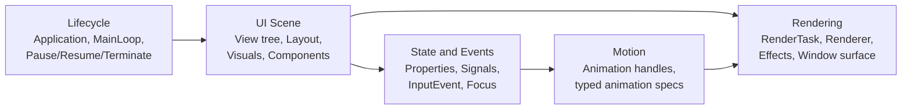

일반적인 애플리케이션 구조는 다음 흐름입니다.

1. `Application::New`로 `Dali::Application`을 생성합니다.
2. 초기화 로직을 `InitSignal`에 연결합니다.
3. init callback 안에서 `GetWindow`를 호출합니다.
4. root `Dali::Ui::View` tree를 생성합니다.
5. root view를 `Dali::Window`에 추가합니다.
6. `MainLoop`에 진입합니다.

이 구조는 DALi의 lifecycle boundary를 명확하게 만듭니다. 애플리케이션 객체는 event loop와 window를 소유하는 runtime 안에 존재하고, UI content는 view tree로 표현됩니다.

짧게 정리하면, adaptor는 process를 DALi runtime 안으로 진입시키고, dali-ui는 애플리케이션에 view/component vocabulary를 제공하며, DALi Core는 그 아래에서 retained object, signal, property, animation, rendering machinery를 제공합니다.

## 핵심 컨셉

### Application과 Window

`Dali::Application`은 runtime을 초기화하고 `InitSignal`, `PauseSignal`, `ResumeSignal`, `TerminateSignal`, `ResetSignal`, `LanguageChangedSignal`, `RegionChangedSignal`, `LowBatterySignal`, `LowMemorySignal`, `DeviceOrientationChangedSignal` 같은 lifecycle/system signal을 제공합니다.

`Dali::Window`는 visible tree가 올라가는 host입니다. public API에는 actor 추가/제거, window background color 설정, root/overlay layer 접근, render task 접근, key/touch/window signal 수신 등이 포함됩니다. dali-ui 애플리케이션에서 window에 추가되는 root object는 일반적으로 `Dali::Ui::View` 또는 view-derived component여야 합니다.

### 앱 중심 UI 객체로서의 View

`Dali::Ui::View`는 앱이 직접 다루는 가장 중심적인 UI 개념입니다. 애플리케이션 UI를 구성하는 기본 UI object이며, 다음 기능을 제공합니다.

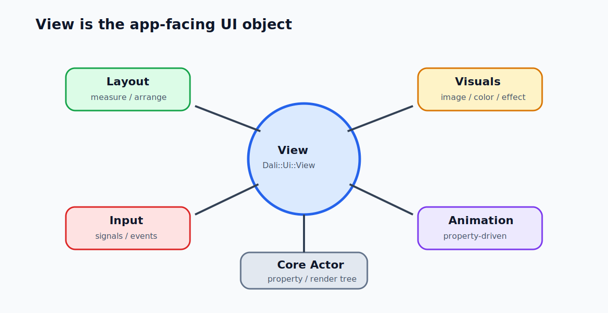

- parent/child view composition을 통한 hierarchy 구성,
- typed setter와 fluent method chaining,
- requested, measured, current size/state를 통한 layout 참여,
- background, border, corner radius, visual 같은 visual decoration,
- `InteractiveTrait`을 통한 interaction,
- typed animation bridge/spec 및 `Dali::Animation`을 통한 animation,
- 필요한 경우 generic handle에서의 downcast.

이 점은 중요한 아키텍처상의 구분입니다. DALi Core에는 `Actor`가 있지만, dali-ui 애플리케이션은 `View`를 중심으로 구성됩니다. 실제로 `Actor`는 core retained object/render tree의 기반이고, `View`는 application-level UI abstraction이라고 보는 것이 적절합니다.

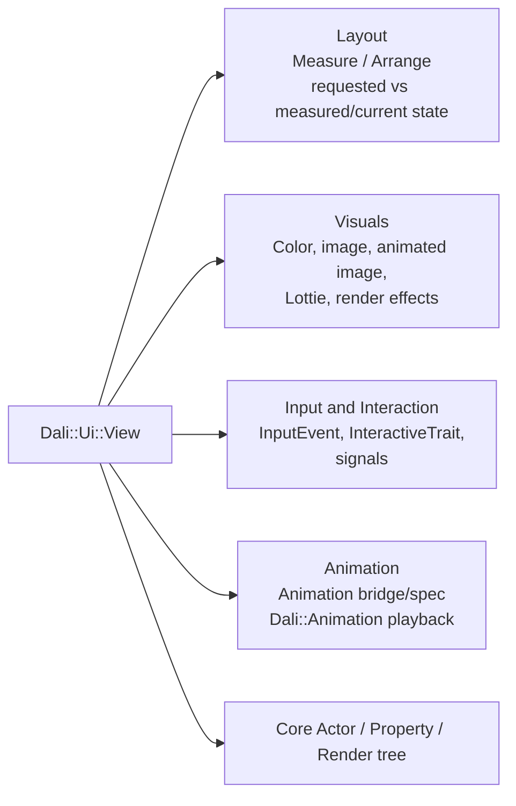

### Layout

DALi UI의 layout은 명시적인 object 기반 구조입니다. `Dali::Ui::Layout`은 `View` specialization이며, concrete layout으로는 `AbsoluteLayout`, `FlexLayout`, `GridLayout`이 있습니다. child별 layout 동작은 `AbsoluteLayoutParams`, `FlexLayoutParams`, `GridLayoutParams` 같은 layout parameter object가 담당합니다.

DALi UI는 requested layout input과 measured/current result를 분리합니다. View는 width, height, margin 및 관련 constraint를 요청할 수 있고, layout pass는 view를 measure/arrange하며, 애플리케이션 코드는 measured state와 current state를 별도로 확인할 수 있습니다.

이는 다른 retained UI framework에서도 볼 수 있는 layout 개념과 유사하지만, DALi는 measure/arrange의 구분을 `View` API와 layout parameter handle을 통해 직접 노출합니다.

### Visuals

Visual은 `Dali::Ui::View`에 attach되는 reusable visual content object입니다. Color fill, image, animated image, Lottie content, effect 같은 시각 요소를 표현하는 데 사용됩니다. Visual을 사용하면 모든 시각 요소를 별도의 high-level UI component로 만들지 않고도 view가 visual content를 가질 수 있습니다.

결과적으로 DALi의 composition model은 두 층으로 나뉩니다.

- `View` tree는 structure, layout, interaction, ownership을 담당합니다.
- Visual은 view가 정의한 영역 또는 range 안에서 rendered content를 제공합니다.

### Signals와 Events

DALi는 event delivery에 `Dali::Signal`을 사용합니다. Signal은 typed callback signature를 가지며, `ConnectionTracker`로 관리할 수 있고, non-void signal type의 return-value 동작도 지원합니다. Application, window, view, interactive trait, image loading, focus management, 여러 component API가 signal connection을 사용합니다.

Input은 typed event object로 표현됩니다. `Dali::Ui::InputEvent`는 touch, key, tap, long press, wheel 또는 input cause가 없는 상태를 표현할 수 있습니다. Interactive view와 trait은 애플리케이션 callback에 `InputEvent`를 전달하므로, 애플리케이션 코드는 모든 event source를 별도 API family로 취급하지 않고도 interaction의 원인을 확인할 수 있습니다.

### Animation

DALi에는 first-class animation model이 있습니다. dali-ui 앱은 typed animation bridge/spec을 통해 `View`를 animate하고, playback control에는 `Dali::Animation`을 사용할 수 있습니다. 즉 animation은 단순한 widget-level helper가 아니라 property/object model과 연결된 runtime object입니다.

아키텍처 관점에서 이는 중요합니다. 애플리케이션 UI state는 view property로 표현될 수 있고, 애플리케이션 코드가 매번 수동으로 값을 갱신하는 대신 DALi runtime이 animation을 처리할 수 있습니다.

### Manager와 Cross-Cutting Service

DALi UI는 view tree 주변의 service들도 제공합니다.

- focus behavior를 위한 `FocusManager`,
- scale factor를 위한 `UiScaleManager`,
- theme 및 color binding을 위한 `UiThemeManager`, `UiColorManager`,
- configuration을 위한 `UiConfig`, `UiComponentConfig`,
- asynchronous image data workflow를 위한 image loading API.

이는 DALi UI가 control 집합에만 머무르지 않는다는 점을 보여줍니다. Styling, scaling, focus, resource, configuration을 위한 application-wide system도 함께 제공합니다.

### Resource Loading과 Async Work

DALi에는 비용이 큰 작업을 main event path 밖으로 옮기기 위한 API가 있습니다. `Dali::Ui::AsyncImageLoader`가 가장 명확한 public 예입니다. 이 API는 main event thread를 block하지 않기 위해 URL의 pixel data를 worker thread에서 비동기로 load합니다. 각 `Load` 호출은 task id를 반환하고, 완료는 `ImageLoadedSignal`로 전달됩니다.

Adaptor의 devel API에는 worker thread가 main event thread에서 callback 실행을 trigger하기 위한 `EventThreadCallback`도 있습니다. 이는 아키텍처적으로 중요한 신호입니다. Background work는 존재하지만, UI-facing callback과 object 변경은 framework의 event/UI side로 돌아와야 합니다.

## 동작상 주요 특징

### Runtime Startup Flow

애플리케이션 시작 흐름은 signal 중심입니다. 애플리케이션은 `Application` handle을 만들고, `InitSignal`에 연결한 뒤, `MainLoop`에 진입합니다. UI 생성은 init callback 안에서 이루어집니다.

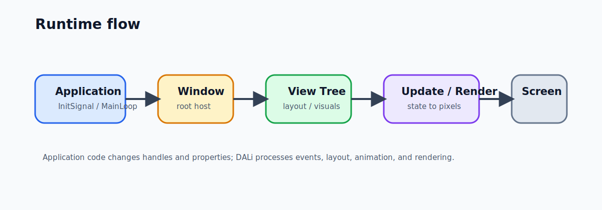

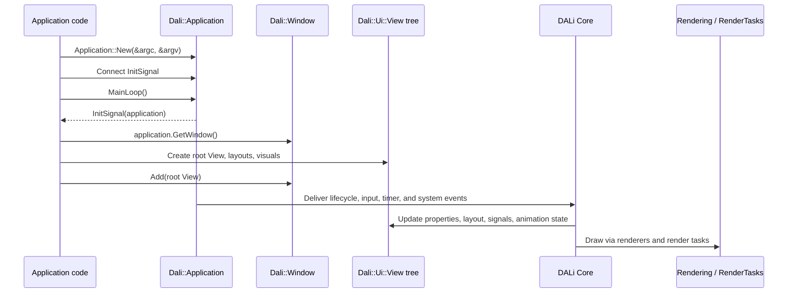

### Retained Tree와 Handle Semantics

DALi API는 handle object를 사용합니다. `View` handle은 underlying object를 참조하며, handle을 복사하면 같은 객체에 대한 또 다른 reference를 유지합니다. 이는 사용자 코드가 매 frame마다 UI를 다시 만드는 immediate-mode UI model과 다릅니다.

Qt, Android, Flutter 등에 익숙한 개발자에게 가장 가까운 개념은 retained object tree입니다. 애플리케이션 코드는 object를 만들고, callback을 연결하고, property를 변경하며, framework가 layout, signal, animation, rendering을 처리하게 합니다.

### Layout State와 Render State의 분리

DALi UI는 layout intent와 current visual state를 분리합니다. Requested size/position, measured size, current size, transform, color, visual state, rendered result는 모두 같은 범주의 값이 아닙니다.

아키텍처 관점에서 이는 애플리케이션이 layout 참여에는 layout API를 사용하고, animated 또는 current visual behavior에는 animation/render-state API를 사용해야 한다는 의미입니다. Layout-driven UI에 low-level property write를 섞는 것은 기본 패턴이 아니라 의도적인 선택이어야 합니다.

### ParentOrigin과 Pivot

DALi의 positioning과 transform을 이해할 때 특히 중요한 개념이 두 가지 있습니다.

- `ParentOrigin`은 부모 좌표 공간 안에서 기준점을 선택합니다.
- `Pivot`은 자식 객체 자체 안에서 기준점을 선택합니다.

자식 view가 배치될 때 자식의 pivot은 선택된 parent origin을 기준으로 정렬됩니다. 그래서 같은 position 값을 사용하더라도 자식이 `Pivot::TOP_LEFT`, `Pivot::CENTER`, 또는 다른 pivot constant를 쓰는지에 따라 실제 보이는 결과가 달라질 수 있습니다.

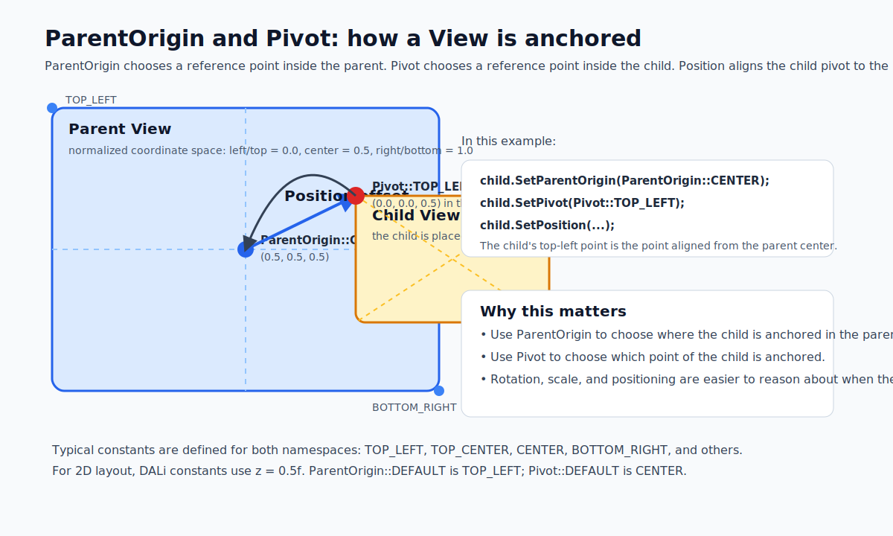

2D layout에서 DALi의 predefined `ParentOrigin`과 `Pivot` constant는 `z = 0.5f`를 사용합니다. `ParentOrigin::DEFAULT`는 `TOP_LEFT`이고, `Pivot::DEFAULT`는 `CENTER`입니다. 애플리케이션 코드는 명시적인 anchoring behavior가 필요할 때 `Dali::Ui::View::SetParentOrigin`과 `Dali::Ui::View::SetPivot`을 사용할 수 있습니다.

### Input Delivery와 Interaction

Core 레벨에서 `Actor`는 touch 및 hover signal 동작을 가지며, hit testing은 sensitivity, visibility, size, color opacity, camera/render-task context, 관련 input signal 연결 여부 같은 조건에 영향을 받습니다. dali-ui 레벨에서 애플리케이션 코드는 일반적으로 `InteractiveTrait`, `InteractiveView`, focus management, typed input event 같은 `View` interaction API를 사용합니다.

이 구조는 DALi가 low-level scene/event control과 higher-level component interaction을 모두 제공한다는 뜻입니다. App-level guidance에서는 core actor behavior와 직접 통합해야 하는 경우가 아니라면 view-centric input API를 우선 사용하는 것이 적절합니다.

### Rendering과 Effects

DALi는 core class와 view-level effect를 통해 rendering 개념을 노출합니다. Effect object에는 Gaussian blur, background blur, mask effect 등이 있습니다. `Window` API는 render task 접근을 제공하며, core public API에는 rendering 관련 class들이 포함됩니다.

실용적인 아키텍처 포인트는 DALi가 rendering model을 widget 뒤에 완전히 숨기지 않는다는 점입니다. DALi는 앱 생산성을 위한 UI component와 visual을 제공하면서도, 필요한 경우 public API를 통해 render task, renderer, visual, effect, texture, shader, property-driven animation 같은 개념을 사용할 수 있게 합니다.

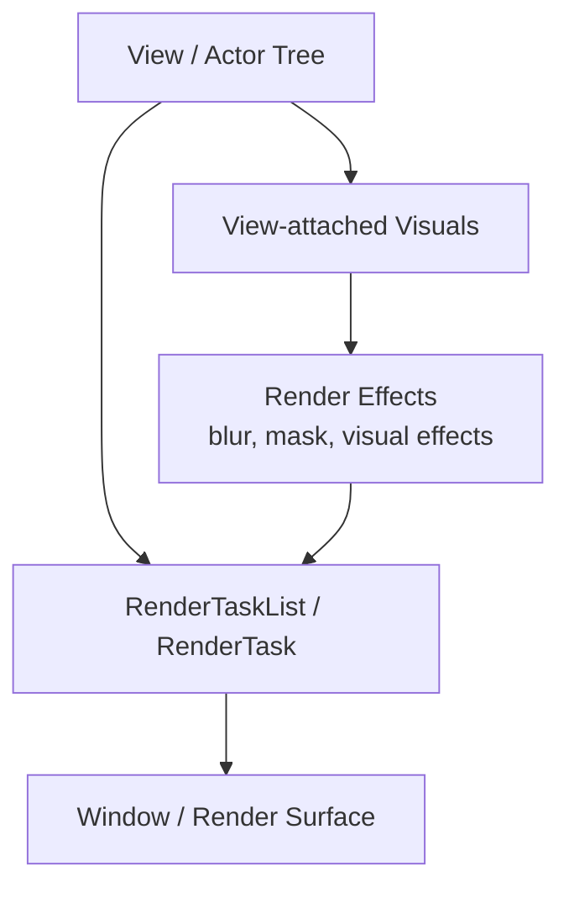

## Runtime과 Threading Model

DALi는 public 및 integration header에서 여러 thread 관련 개념을 노출합니다. 이 모델을 가장 안전하게 설명하는 방법은 하나의 고정된 thread layout으로 단정하는 것이 아니라, event/UI side, worker task, update/render side가 분리되어 있다고 보는 것입니다.

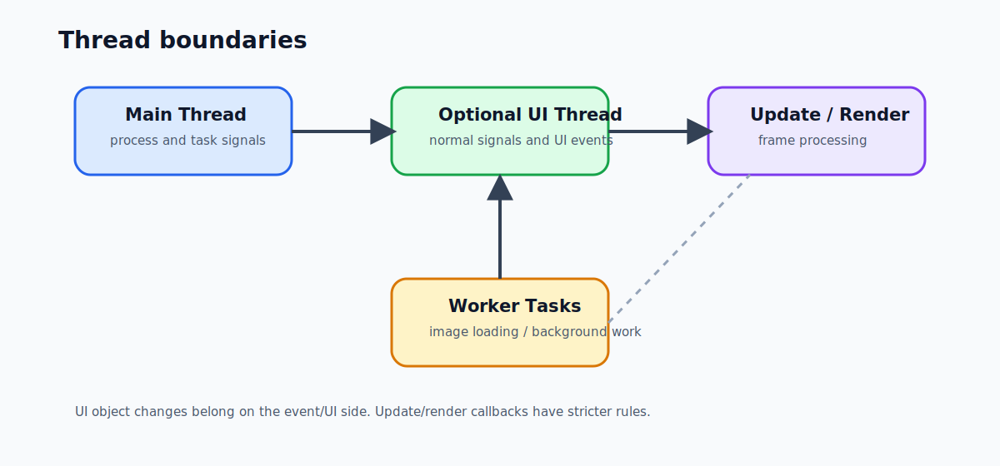

### Event, UI, Task Signal

`Dali::Application`은 optional UI thread feature를 제공합니다. 이 기능이 켜지면 `Application`은 UI event를 위한 추가 UI thread를 생성합니다. 이 모드에서 `Init`, `Terminate`, `Pause`, `Resume`, `Reset`, `AppControl`, language, region, low battery, low memory 같은 normal application signal은 UI thread에서 emit됩니다. `TaskInit`, `TaskTerminate`, `TaskAppControl`, `TaskLanguageChanged`, `TaskLowBattery`, `TaskLowMemory` 같은 task signal은 main thread에서 emit됩니다.

같은 header는 이 기능이 켜진 경우 task signal을 제외한 DALi signal callback이 UI thread에서 emit된다고 설명하며, timer callback을 예로 듭니다. UI thread feature를 사용하지 않는 경우, normal application signal 문서는 해당 signal들이 main thread에서 emit된다고 설명합니다.

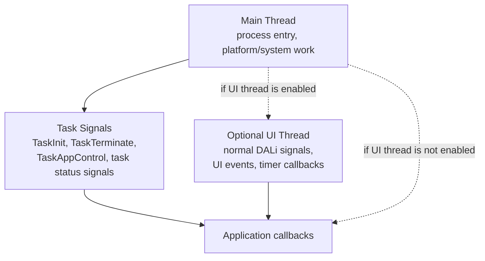

실용적인 규칙은 UI object 작업이 DALi event/UI side에서 수행되어야 한다는 것입니다. `Application` 문서는 low-memory 처리처럼 window나 actor를 다뤄야 하는 경우 task signal이 아니라 normal signal을 사용해야 한다고 명시합니다.

### Update와 Render Side

Adaptor integration API는 별도의 update/render execution side가 있음을 보여줍니다. `Adaptor::SetPreRenderCallback`은 callback이 rendering 전에 Update/Render thread에서 호출된다고 설명하며, 가능한 적은 작업만 해야 한다고 경고합니다. 또한 그 callback 안에서 DALi event-side API를 호출하면 instability가 발생할 수 있다고 명시합니다.

내부 adaptor threading-mode header는 현재 `COMBINED_UPDATE_RENDER`을 Event, V-Sync, joint Update/Render thread로 구성된 mode라고 이름 붙입니다. 다른 integration API들은 render-thread callback과 render thread id도 노출합니다. 따라서 중요한 아키텍처 포인트는 모든 build에서의 정확한 thread 개수가 아니라, event-side API usage와 update/render execution이 서로 다른 concern이라는 경계입니다.

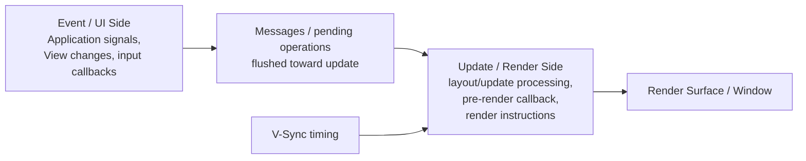

`UiContext` 역시 `FlushUpdateMessages`를 제공하며, 이는 application을 relayout하고 모든 pending operation을 update thread로 flush하도록 보장하는 기능입니다. 이는 app-side 변경이 call site에서 곧바로 rendering work로 실행되는 것이 아니라 update/render side로 전달된다는 관점을 뒷받침합니다.

### Worker Task와 Callback Return

일부 DALi subsystem은 비용이 큰 작업에 worker thread를 사용합니다. `AsyncImageLoader`는 image pixel data를 worker thread에서 load하고, 완료는 `ImageLoadedSignal`을 통해 전달합니다. Adaptor devel API의 `EventThreadCallback`은 worker thread가 main event thread에서 callback을 실행하도록 trigger하는 일반 mechanism을 제공합니다.

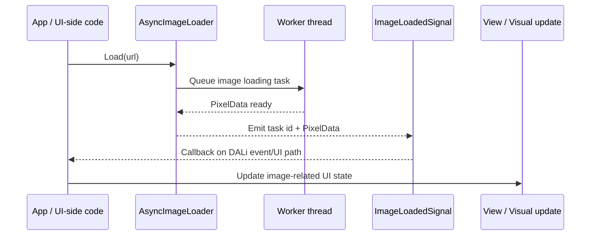

이 패턴은 애플리케이션 설계에서 중요합니다. 오래 걸리는 I/O나 decoding은 event/UI path를 block하지 않아야 합니다. 동시에 UI update는 framework callback과 public handle을 통해 event/UI side에서 수행되어야 합니다.

## 다른 UI 프레임워크와 비교했을 때의 특징

Qt, Android, Flutter 또는 유사한 프레임워크에 익숙한 사람에게 DALi는 다음 특징을 가집니다.

- C++ 기반이며, `Application`, `Window`, `View`, `Layout`, `Visual`, `Signal`, `Animation` 같은 명시적인 public handle을 사용합니다.
- 앱 중심 UI model은 view-centric이지만, underlying core model은 actor/property/render 개념을 노출합니다.
- Animation을 per-widget helper에 그치지 않고 first-class runtime object로 다룹니다.
- Application lifecycle, window event, component event, interaction, resource loading, manager 전반에 typed signal을 사용합니다.
- Layout request/measure/arrange state와 current rendered state를 분리합니다.
- Child widget만이 아니라 view-attached visual을 통한 visual composition을 지원합니다.
- 일반 앱 코드는 `Dali::Ui::View` 계층에 머무를 수 있지만, 필요한 경우 lower-level rendering/effect 개념에도 접근할 수 있습니다.
- Normal UI work, optional UI-thread signal delivery, worker-thread resource loading, update/render-side callback처럼 thread boundary가 API에 비교적 명확하게 드러납니다.

이 구조의 주요 장점은 유연성입니다. 애플리케이션은 대부분 high-level dali-ui 관점으로 작성할 수 있지만, framework는 복잡한 UI 동작을 위해 object, property, animation, rendering model을 충분히 public API로 노출합니다.

그에 따른 책임도 있습니다. 애플리케이션 코드는 일반적으로 view-centric public API에 머물고, typed setter와 layout parameter를 사용하며, signal signature를 정확히 연결하고, core actor/render API는 실제로 lower-level control이 필요한 경우에 한해 사용하는 것이 좋습니다.
