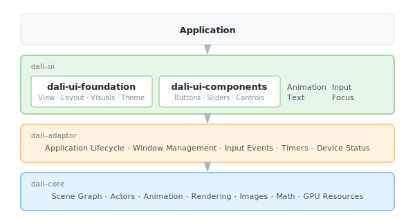

# DALi 개요

## DALi란 무엇인가

DALi(Dynamic Animation Library)는 하드웨어 가속 사용자 인터페이스를 구축하기 위한 C++로 작성된 크로스 플랫폼 UI 프레임워크입니다. UI 요소가 트리 구조로 유지되고 프레임워크가 렌더링, 레이아웃, 입력 처리를 담당하는 유지 모드 장면 그래프 아키텍처를 제공합니다.

프레임워크는 세 개의 계층화된 저장소로 구성됩니다:

- **dali-core**는 렌더링 기반을 제공합니다: 액터의 장면 그래프, 속성 애니메이션, 이미지 로딩, GPU 리소스 관리
- **dali-adaptor**는 플랫폼 통합 계층을 제공합니다: 애플리케이션 수명 주기, 윈도우 관리, 입력 이벤트 디스패치, 장치 상태 모니터링
- **dali-ui**는 UI 컴포넌트 계층을 제공합니다: 자동 레이아웃, 테마, 내장 인터랙션 패턴이 있는 View 기반 위젯 시스템

애플리케이션은 일반적으로 dali-ui 계층을 사용하며, 이는 더 높은 수준의 추상화를 제공하기 위해 하위 계층을 기반으로 구축됩니다.

## DALi 구조

dali-ui 라이브러리는 두 개의 하위 라이브러리로 나뉩니다:

- **dali-ui-foundation**은 핵심 추상화를 제공합니다: 기본 [View](view.md) 클래스, [레이아웃 컨테이너](layouts.md), [비주얼](visuals.md), [텍스트 렌더링](text.md), [테마](ui-color-manager.md), 유틸리티 타입
- **dali-ui-components**는 바로 사용할 수 있는 컨트롤을 제공합니다: 버튼, 슬라이더, 파운데이션 계층을 기반으로 구축된 복합 컴포넌트

파운데이션 계층은 **Trait 시스템**을 도입하여 View에 조합 가능한 동작을 첨부할 수 있습니다. 예를 들어, [InteractiveView](interactive-view.md)는 클릭 처리를 추가하고, 선택 가능 trait은 선택 상태 관리를 추가합니다.

## 애플리케이션 대면 모델

애플리케이션은 View 계층을 통해 DALi와 상호작용합니다. [View](view.md)는 레이아웃에 참여하고, 비주얼을 렌더링하고, 입력에 응답하는 기본 UI 객체입니다. View는 부모-자식 트리로 배열되며, 각 View의 크기와 위치는 부모 컨테이너의 레이아웃 알고리즘에 의해 결정됩니다.

레이아웃 시스템은 Measure/Arrange 패스 모델을 사용합니다. View는 `WRAP_CONTENT`(콘텐츠 크기) 또는 `MATCH_PARENT`(부모 채우기)를 사용하여 크기를 요청하고, 부모 레이아웃이 최종 위치를 계산합니다. 네 가지 레이아웃 컨테이너가 제공됩니다:

- [AbsoluteLayout](layouts.md)은 명시적 좌표에 자식 배치
- [StackLayout](layouts.md)은 단일 행 또는 열로 자식 배치
- [FlexLayout](layouts.md)은 grow, shrink, wrap이 있는 flexbox 스타일 레이아웃 제공
- [GridLayout](layouts.md)은 행과 열이 있는 그리드로 자식 배치

View는 **비주얼**—뷰에 첨부된 렌더링 가능한 객체—를 통해 콘텐츠를 표시합니다. [ImageVisual](visuals.md)은 이미지를 표시하고, [ColorVisual](visuals.md)은 단색으로 채우고, [AnimatedImageVisual](visuals.md)은 애니메이션 시퀀스를 재생합니다. 여러 비주얼이 단일 View에 겹쳐질 수 있습니다.

## 인터랙션, 모션, 프레젠테이션

DALi는 일반적인 UI 동작을 위한 내장 패턴을 제공합니다:

**입력 및 포커스** — [InteractiveView](interactive-view.md)는 클릭과 롱 프레스를 처리합니다. [FocusManager](focus-manager.md)는 방향성 포커스 이동과 포커스 그룹이 있는 키보드 탐색을 제공합니다. [ViewState](view-state.md)는 포커스, 눌림, 비활성화와 같은 인터랙티브 상태를 추적합니다.

**애니메이션** — [Animation](animation.md) API는 알파 함수(이징 곡선), 키프레임, 루핑을 사용하여 View의 애니메이션 가능한 속성을 애니메이션합니다. 애니메이션은 위치, 크기, 불투명도, 색상, 커스텀 속성을 대상으로 할 수 있습니다.

**테마** — [UiColorManager](ui-color-manager.md)는 테마 기반 색상 조회를 제공합니다. [UiColor](ui-color.md)는 명시적 RGBA 값이거나 런타임에 해결되는 테마 참조일 수 있는 색상을 나타냅니다.

**이미지** — [ImageView](image-view.md)는 피팅 모드와 마스킹이 있는 정적 이미지를 표시합니다. [AnimatedImageView](animated-image-view.md)는 GIF와 애니메이션 WebP 파일을 재생합니다. [LottieAnimationView](lottie-animation-view.md)는 After Effects 내보내기에서 벡터 애니메이션을 렌더링합니다.

**텍스트** — [Label](label.md)은 여러 줄 레이아웃, 마퀴 스크롤, 스타일링 효과가 있는 편집 불가능한 텍스트를 표시합니다. [InputField](input-field.md)는 커서와 선택 관리가 있는 한 줄 텍스트 입력을 제공합니다.

**스크롤** — [ScrollView](scroll-view.md)는 가시 영역보다 큰 콘텐츠를 위한 스크롤 가능한 뷰포트를 제공하며, 플링 동작과 스크롤 바가 있습니다.

## 다음 단계

이 문서의 가이드는 기능 영역별로 구성되어 있습니다. 핵심 View API를 이해하려면 [View (기본 UI 객체)](view.md)로 시작한 다음, View 배치 방법을 배우려면 [레이아웃](layouts.md)을 살펴보세요. 인터랙티브 컴포넌트는 [InteractiveView](interactive-view.md)와 [FocusManager](focus-manager.md)를 참조하세요. 시각적 콘텐츠는 [ImageView](image-view.md), [Label](label.md), [Animation](animation.md)을 참조하세요.

