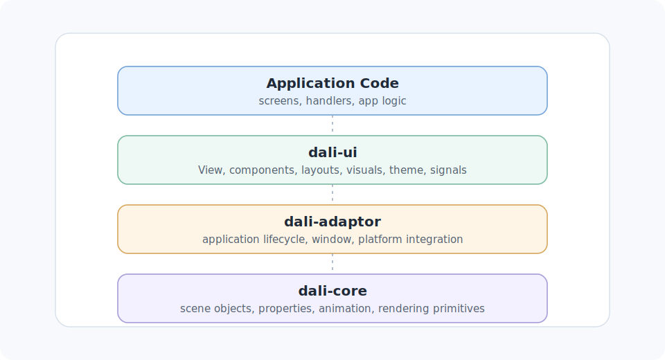

# DALi Overview

## What DALi Is

DALi is a UI toolkit built around a scene of visual objects that are created and controlled from application code. In the `dali-ui` layer, the main app-facing object is `Dali::Ui::View`: a handle used to build screens, attach child views, configure visual properties, receive interaction events, and start animations.

A useful first mental model is:

- the application starts through the adaptor framework;
- the app builds a tree of `Dali::Ui::View` objects;
- views are arranged by layouts, styled with colors and visuals, and updated through typed APIs;
- input, focus, resource loading, and lifecycle changes are reported through signals and event objects.

The detailed guides use this view-centered model throughout. For the base object, start with [View (Base UI Object)](guide/view.md). For application startup and lifecycle, see [Adaptor Framework](guide/adaptor-framework.md).

## How DALi Is Organized

The guide set is organized around the main areas an application touches:

- Application setup and platform integration: [Adaptor Framework](guide/adaptor-framework.md), [Addon Manager](guide/addon-manager.md).
- View composition and components: [View (Base UI Object)](guide/view.md), [Layouts](guide/layouts.md), [Interactive View](guide/interactive-view.md), [Label](guide/label.md), [Input Field](guide/input-field.md), [Image View](guide/image-view.md), [Animated Image View](guide/animated-image-view.md), [Lottie Animation View](guide/lottie-animation-view.md), [Scroll View](guide/scroll-view.md), [Scroll Bar](guide/scroll-bar.md), [Web View](guide/web-view.md).
- Input and state: [Input Event](guide/input-event.md), [State Event](guide/state-event.md), [View State](guide/view-state.md), [Focus Manager](guide/focus-manager.md), [Accessibility Highlight Overlay](guide/accessibility-highlight-overlay.md).
- Presentation: [Visuals](guide/visuals.md), [Image](guide/image.md), [Image Loader](guide/image-loader.md), [Render Effects](guide/render-effects.md), [Text](guide/text.md), [Ui Color](guide/ui-color.md), [Ui Color Manager](guide/ui-color-manager.md), [Ui Theme Manager](guide/ui-theme-manager.md), [Ui Scale Manager](guide/ui-scale-manager.md).
- Configuration and utilities: [Ui Config](guide/ui-config.md), [Ui Component Config](guide/ui-component-config.md), [Signals](guide/signals.md), [Attachment Id](guide/attachment-id.md), [Trait Id](guide/trait-id.md), [Unique Any](guide/unique-any.md), [I Scroll Bar](guide/i-scroll-bar.md).

## The App-Facing Model

Most application code works with DALi through handle types. A handle represents an underlying object and can usually be copied through application code while still referring to the same DALi object. The guides call out when a default-constructed handle is uninitialized and when a factory or singleton accessor should be used instead.

`Dali::Ui::View` is the common unit of composition. Component types such as `Label`, `ImageView`, `InputField`, `ScrollView`, and `WebView` are still views, so they can be placed in the same view tree and configured through component-specific APIs. Layout containers are also view objects; they arrange child views using typed layout objects and per-child layout parameters. See [Layouts](guide/layouts.md) for flex, absolute, grid, and stack layout behavior.

DALi also uses explicit event and state objects. [Input Event](guide/input-event.md) describes the input cause delivered through interactive callbacks. [View State](guide/view-state.md) represents states such as focused, pressed, disabled, and selected. [State Event](guide/state-event.md) describes a transition between view states.

## Interaction, Motion, and Presentation

Interaction is usually handled through view callbacks and signals. [Interactive View](guide/interactive-view.md) covers clickable and pressable surfaces, while [Signals](guide/signals.md) explains how application code connects to view, input, resource, and lifecycle events and keeps connection lifetime explicit. Keyboard focus is coordinated through [Focus Manager](guide/focus-manager.md), with accessibility focus presentation covered by [Accessibility Highlight Overlay](guide/accessibility-highlight-overlay.md).

Motion is expressed through typed animation APIs that operate on views. [Animation](guide/animation.md) covers direct view animation, reusable motion specifications, timing, easing, looping, reversing, pausing, and end behavior.

Presentation is split across several concepts. [Visuals](guide/visuals.md) covers lightweight drawing objects attached to views for images, colors, animated images, and Lottie content. [Image View](guide/image-view.md), [Animated Image View](guide/animated-image-view.md), and [Lottie Animation View](guide/lottie-animation-view.md) cover component views for those resources. [Render Effects](guide/render-effects.md) covers blur and mask effects. [Ui Color](guide/ui-color.md), [Ui Color Manager](guide/ui-color-manager.md), and [Ui Theme Manager](guide/ui-theme-manager.md) cover direct colors, theme color tokens, and theme-change handling.

## Where To Go Next

If you are reading the guide set for the first time, a practical order is:

1. [Adaptor Framework](guide/adaptor-framework.md) for startup, lifecycle, and the main window.
2. [View (Base UI Object)](guide/view.md) for the basic object model.
3. [Layouts](guide/layouts.md) for arranging views.
4. [Signals](guide/signals.md), [Input Event](guide/input-event.md), and [Focus Manager](guide/focus-manager.md) for interaction.
5. [Visuals](guide/visuals.md), [Image View](guide/image-view.md), [Text](guide/text.md), and [Ui Color](guide/ui-color.md) for presentation.
6. [Animation](guide/animation.md) and [Render Effects](guide/render-effects.md) for motion and view-level effects.
7. [Ui Config](guide/ui-config.md), [Ui Scale Manager](guide/ui-scale-manager.md), and [Ui Theme Manager](guide/ui-theme-manager.md) for application-wide defaults and runtime environment settings.

The links are navigation aids. Each detailed guide is intended to stand on its own when you need that topic.

## Guide Index

### Application Setup and Platform Integration

- [Adaptor Framework](guide/adaptor-framework.md)
- [Addon Manager](guide/addon-manager.md)

### View Composition and Components

- [View](guide/view.md)
- [Layouts](guide/layouts.md)
- [Interactive View](guide/interactive-view.md)
- [Label](guide/label.md)
- [Input Field](guide/input-field.md)
- [Image View](guide/image-view.md)
- [Animated Image View](guide/animated-image-view.md)
- [Lottie Animation View](guide/lottie-animation-view.md)
- [Scroll View](guide/scroll-view.md)
- [Scroll Bar](guide/scroll-bar.md)
- [Web View](guide/web-view.md)

### Input, State, and Accessibility

- [Input Event](guide/input-event.md)
- [State Event](guide/state-event.md)
- [View State](guide/view-state.md)
- [Focus Manager](guide/focus-manager.md)
- [Accessibility Highlight Overlay](guide/accessibility-highlight-overlay.md)

### Presentation

- [Visuals](guide/visuals.md)
- [Image](guide/image.md)
- [Image Loader](guide/image-loader.md)
- [Render Effects](guide/render-effects.md)
- [Text](guide/text.md)
- [Ui Color](guide/ui-color.md)
- [Ui Color Manager](guide/ui-color-manager.md)
- [Ui Theme Manager](guide/ui-theme-manager.md)
- [Ui Scale Manager](guide/ui-scale-manager.md)

### Configuration and Utilities

- [Ui Config](guide/ui-config.md)
- [Ui Component Config](guide/ui-component-config.md)
- [Signals](guide/signals.md)
- [Attachment Id](guide/attachment-id.md)
- [Trait Id](guide/trait-id.md)
- [Unique Any](guide/unique-any.md)
- [I Scroll Bar](guide/i-scroll-bar.md)
