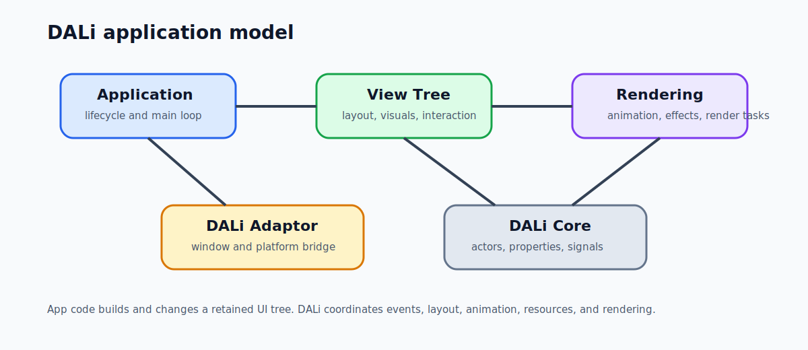
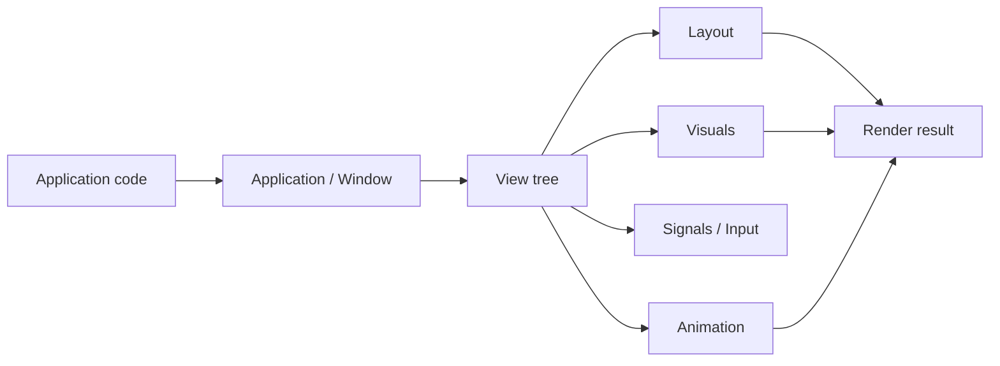

# DALi Overview

DALi, the Digital Adaptive Library, is a C++ UI framework for building interactive, animated, visually rich application interfaces. A DALi app is structured around an application runtime, a window, a retained `Dali::Ui::View` tree, signals, layout, visual content, animation, and rendering.

## At a Glance

- `Dali::Application` starts the runtime, owns the main loop, and provides lifecycle signals.
- `Dali::Window` hosts the visible scene.
- `Dali::Ui::View` is the app-facing UI object used to build view trees.
- Layout objects arrange views; visual objects provide color, image, animated, Lottie, and effect content.
- Signals deliver lifecycle, input, component, resource, and interaction events.
- `Dali::Animation` and typed animation APIs drive property-based motion.
- DALi Core provides the actor, property, signal, event, animation, rendering, and render-task foundation underneath dali-ui.

## The Mental Model

Think of DALi as a retained UI system. Application code creates handles, connects signals, builds a view tree, updates properties, and lets DALi process layout, events, animation, resources, and rendering.

This is different from immediate-mode UI models where user code redraws the interface each frame. In DALi, the framework owns the runtime flow; application code expresses UI state and behavior through public handles.

## How the Pieces Fit Together

DALi has three major layers that matter to application architecture.

| Layer | Role |
| --- | --- |
| DALi UI | App-facing UI concepts such as `View`, layouts, visuals, labels, image views, web views, focus, theme, scale, and configuration managers. |
| DALi Adaptor | Runtime bridge for `Application`, `Window`, lifecycle signals, platform events, and event loop integration. |
| DALi Core | Foundation for actors, properties, signals, animations, input events, renderers, render tasks, textures, and rendering behavior. |

Most application code should stay in the dali-ui layer and use `Dali::Ui::View`, typed setters, layout parameters, visuals, and signals. Core and adaptor APIs remain important, but they are usually the foundation or integration context rather than the default way to build app UI.

## What Makes DALi Distinct

DALi is useful when an application needs a structured UI tree and rich animated visual behavior in the same framework.

- It combines high-level UI objects with lower-level render and animation concepts.
- It makes animation a first-class runtime object, not only a widget helper.
- It separates layout intent from current rendered state.
- It supports visual composition through view-attached visuals, not only child components.
- It exposes typed signals consistently across lifecycle, input, interaction, loading, and component APIs.
- It provides thread-aware runtime boundaries for UI events, worker tasks, and update/render processing.

In short, DALi is designed for applications that need a structured UI object model and a runtime capable of coordinating layout, input, animation, resource loading, and rendering as one system. The best way to approach DALi is to think in terms of a `View` tree running inside an `Application` and `Window`, with DALi Core providing the lower-level object, signal, animation, and rendering foundation.
