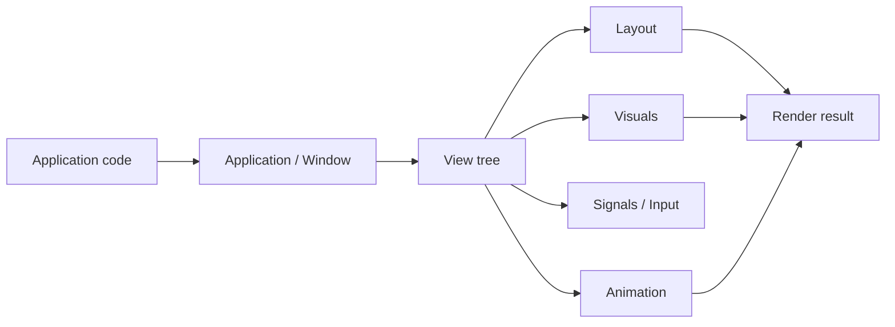

# DALi 개요 {#dali-overview}

DALi(Digital Adaptive Library)는 interactive하고 animated하며 visually rich한 애플리케이션 UI를 만들기 위한 C++ UI framework입니다. DALi 앱은 application runtime, window, retained `Dali::Ui::View` tree, signal, layout, visual content, animation, rendering을 중심으로 구성됩니다.

## 한눈에 보기 {#at-a-glance}

- `Dali::Application`은 runtime을 시작하고 main loop와 lifecycle signal을 제공합니다.
- `Dali::Window`는 visible scene이 올라가는 host입니다.
- `Dali::Ui::View`는 앱이 직접 다루는 UI object이며 view tree를 구성하는 중심입니다.
- Layout object는 view를 배치하고, visual object는 color, image, animated image, Lottie, effect content를 제공합니다.
- Signal은 lifecycle, input, component, resource, interaction event를 전달합니다.
- `Dali::Animation`과 typed animation API는 property 기반 motion을 구동합니다.
- DALi Core는 dali-ui 아래에서 actor, property, signal, event, animation, rendering, render task 기반을 제공합니다.

## Mental Model {#the-mental-model}

DALi는 retained UI system으로 이해하면 좋습니다. 애플리케이션 코드는 handle을 만들고, signal을 연결하고, view tree를 구성하고, property를 갱신합니다. 이후 DALi가 layout, event, animation, resource, rendering 흐름을 처리합니다.

이는 사용자 코드가 매 frame마다 interface를 다시 그리는 immediate-mode UI model과 다릅니다. DALi에서는 framework가 runtime flow를 소유하고, 애플리케이션 코드는 public handle을 통해 UI state와 behavior를 표현합니다.

## 구성 요소가 맞물리는 방식 {#how-the-pieces-fit-together}

DALi는 애플리케이션 아키텍처 관점에서 세 가지 주요 계층으로 이해할 수 있습니다.

| Layer | Role |
| --- | --- |
| DALi UI | `View`, layout, visual, label, image view, web view, focus, theme, scale, configuration manager 같은 app-facing UI 개념을 제공합니다. |
| DALi Adaptor | `Application`, `Window`, lifecycle signal, platform event, event loop integration을 담당하는 runtime bridge입니다. |
| DALi Core | Actor, property, signal, animation, input event, renderer, render task, texture, rendering behavior의 기반입니다. |

대부분의 애플리케이션 코드는 dali-ui layer에 머무르며 `Dali::Ui::View`, typed setter, layout parameter, visual, signal을 사용하는 것이 좋습니다. Core와 adaptor API도 중요하지만, 일반적인 앱 UI를 만드는 기본 수단이라기보다는 foundation 또는 integration context에 가깝습니다.

## DALi의 차별점 {#what-makes-dali-distinct}

DALi는 구조적인 UI tree와 풍부한 animated visual behavior가 함께 필요한 애플리케이션에 적합합니다.

- High-level UI object와 lower-level render/animation concept을 함께 제공합니다.
- Animation을 단순한 widget helper가 아니라 first-class runtime object로 다룹니다.
- Layout intent와 current rendered state를 분리합니다.
- Child component뿐 아니라 view-attached visual을 통한 visual composition을 지원합니다.
- Lifecycle, input, interaction, loading, component API 전반에 typed signal을 일관되게 사용합니다.
- UI event, worker task, update/render processing 사이의 thread-aware runtime boundary를 제공합니다.

정리하면 DALi는 구조적인 UI object model과 layout, input, animation, resource loading, rendering을 하나의 runtime 안에서 조율하는 기능이 함께 필요한 애플리케이션을 위한 framework입니다. DALi를 이해할 때는 `Application`과 `Window` 안에서 동작하는 `View` tree를 중심에 두고, 그 아래에서 DALi Core가 object, signal, animation, rendering 기반을 제공한다고 보면 좋습니다.
